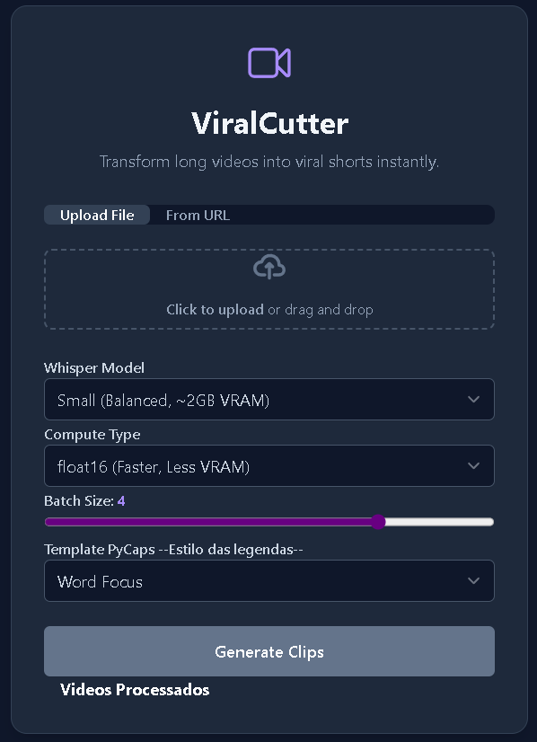

# ViralCutterWeb

Version: 0.1

## Description (English)
ViralCutterWeb is a web application for automatic cutting of viral videos, inspired by [ViralCutter](https://github.com/RafaelGodoyEbert/ViralCutter). It uses artificial intelligence to suggest cuts and the [pycaps](https://github.com/francozanardi/pycaps) package to automatically generate stylized subtitles.

## Main Features
- Upload videos or download via URL
- Automatic suggestion of viral cuts
- Automatic subtitle generation with PyCaps
- Web interface for adjusting cuts and subtitle templates

## Screenshots

### Main Screen


### Finalized Videos Screen


## How to Use
1. Upload a video or provide a URL
2. Adjust the suggested cuts and choose the subtitle template
3. Wait for processing and download the final videos

## Requirements
- Docker
- Python 3.10+
- FFmpeg

## How to Run
```bash
git clone https://github.com/marcao/viralcutterweb.git
cd viralcutterweb
sudo docker compose up -d
```
Access the web interface at `http://localhost:8000`

## Notes
- **Attention:** The average size of the Docker image may be high due to the inclusion of AI and video processing dependencies.
- It is recommended to run on machines with at least 4GB of RAM.

## Inspiration
- [ViralCutter](https://github.com/RafaelGodoyEbert/ViralCutter)
- [pycaps](https://github.com/francozanardi/pycaps)

---
This project is in early development. Suggestions and contributions are welcome!

---

## Versão: 0.1

## Descrição (Português)
ViralCutterWeb é uma aplicação web para corte automático de vídeos virais, inspirada no projeto [ViralCutter](https://github.com/RafaelGodoyEbert/ViralCutter). Utiliza inteligência artificial para sugerir cortes e o pacote [pycaps](https://github.com/francozanardi/pycaps) para geração automática de legendas estilizadas.

## Principais Funcionalidades
- Upload de vídeos ou download via URL
- Sugestão automática de cortes virais
- Geração de legendas automáticas com PyCaps
- Interface web para ajuste dos cortes e templates de legendas

## Capturas de Tela

### Tela Principal


### Tela de Vídeos Finalizados


## Como usar
1. Faça upload de um vídeo ou forneça uma URL
2. Ajuste os cortes sugeridos e escolha o template de legendas
3. Aguarde o processamento e baixe os vídeos finais

## Requisitos
- Docker
- Python 3.10+
- FFmpeg

## Como executar
```bash
git clone https://github.com/marcao/viralcutterweb.git
cd viralcutterweb
sudo docker compose up -d
```
Acesse a interface web em `http://localhost:8000`

## Observações
- **Atenção:** O tamanho médio da imagem Docker pode ser elevado devido à inclusão de dependências de IA e processamento de vídeo.
- Recomenda-se rodar em máquinas com pelo menos 4GB de RAM.

## Inspiração
- [ViralCutter](https://github.com/RafaelGodoyEbert/ViralCutter)
- [pycaps](https://github.com/francozanardi/pycaps)

---
Este projeto está em desenvolvimento inicial. Sugestões e contribuições são bem-vindas!
